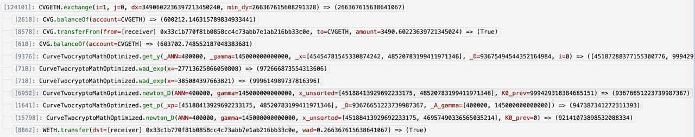

Looking at a [twocrypto-ng swap](https://ethtx.info/mainnet/0xce5ba49b9f916fce565b6eaba8cefd44f47bd968b6ee44bc2bf0c45eeaf77d3c/):



We observed that while we do indeed have an initial guess for the first newton's method for calculating D in tweak_price (before we rebalance liquidity), we could potentially use that precisely calculated D if we are going to rebalance liquidity. This is implemented in [CurveTwocryptoOptimized.vy](./CurveTwocryptoOptimized.vy). To accommodate this further,
there's a refactor of logic in newton_D. Previously newton_D used an initial guess that was derived from K0_prev, and it basically post-processed K0_prev into the initial guess within the method as follows:

```python
D: uint256 = 0
if K0_prev == 0:
    D = N_COINS * isqrt(unsafe_mul(x[0], x[1]))
else:
    # D = isqrt(x[0] * x[1] * 4 / K0_prev * 10**18)
    D = isqrt(unsafe_mul(unsafe_div(unsafe_mul(unsafe_mul(4, x[0]), x[1]), K0_prev), 10**18))
    if S < D:
        D = S
```

What we now has is this K0_prev post processing logic encapsulated in \_exchange method of the AMM contract, such that we do all post-processing outside newton_D. This may not necessarily be desirable, and we may want to refactor this to make it cleaner, such that the AMM contract doesn't have any math logic that is dependent on get_y. So perhaps the math contract should encapsulate all newton's method pre-processing logic.

Tasks:

- [x] Refactor initial guess processing logic outside of newton_D
- [ ] Refactor newton's method pre-processing logic into math contract (does this mean we do an extra external call in \_exchange method?)
- [ ] Write tests
- [ ] Check for convergence (fuzz to ensure there is a tangible improvement)
- [ ] Create analysis charts to show to stakeholders
